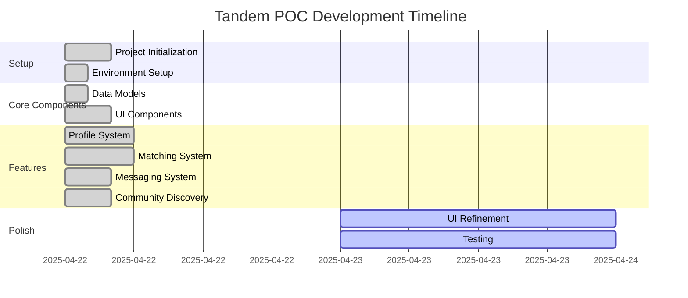

# Tandem - Progress Tracker

## Project Status Overview
**Current Phase**: POC Implementation  
**Status**: Core Matching System implemented  
**Date**: April 22, 2025

## What Works

### Documentation
- ✅ Project brief created and documented
- ✅ Product context established
- ✅ System patterns defined
- ✅ Technical context outlined
- ✅ Active context documented
- ✅ Progress tracking initialized

### Implementation
- ✅ Project setup with React + Vite
- ✅ Tailwind CSS integrated for styling
- ✅ Core routing implemented with React Router
- ✅ Mock data services created
- ✅ Matching algorithm implemented
- ✅ Matching UI components built (MatchCard, MatchList, MatchDetail)
- ✅ App navigation with working links
- ✅ Messaging service layer implemented
- ✅ Messaging UI components built (ConversationList, MessageThread)
- ✅ Real-time UI updates for messaging
- ✅ Profile service layer implemented
- ✅ Profile UI components built (ProfileView, ProfileEditForm)
- ✅ Community service layer implemented
- ✅ Community UI components built (ActivityCard, ActivityList, ActivityDetail)
- ✅ Activity creation form implemented
- ✅ Skills and interests management implemented
- ✅ Profile photo upload functionality implemented
- ✅ Git repository initialized and code pushed to GitHub
- ✅ Project README created with comprehensive documentation

## What's In Progress

### Implementation
- ✅ Profile page implementation 
- ✅ Messaging functionality
- ✅ Community discovery features

## What's Next

### Short-Term (Next Phase)
1. Add additional UI polish
2. Address any bugs or issues
3. Enhance form validation and error handling
4. Add animations for smoother transitions

## Known Issues & Limitations
- Placeholder content for Profile and Community pages
- No server-side implementation (using mock data)
- No real authentication (simulated login state)
- No real-time functionality for messaging

## Implementation Progress

### Data Models
- ✅ User Profile model
- ✅ Skills model
- ✅ Interests model
- ✅ Matching model
- ✅ Messaging model (basic)
- ✅ Community Activity model

### Core Features
- ✅ Profile Creation & Display
- ✅ Matching Algorithm
- ✅ Match Display
- ✅ Messaging Interface
- ✅ Community Discovery
- ✅ Activity Participation

### UI Components
- ✅ Basic Layout and Navigation
- ✅ Match Card
- ✅ Match List with filters
- ✅ Match Details
- ✅ Conversation List
- ✅ Message Thread
- ✅ Activity Card
- ✅ Activity List with filters
- ✅ Activity Detail
- 🔲 Map View

## Technical Debt

### Items to Address Post-POC
- Backend API for data persistence
- Authentication service
- Real geolocation services
- WebSocket for real-time messaging
- Image upload and management
- Performance optimizations
- Accessibility improvements
- Full test coverage
- Fixing Tailwind CSS configuration issues (needed to use older version)

## Feature Progress Timeline

## Decision Log

| Date | Decision | Rationale | Alternatives Considered |
|------|----------|-----------|-------------------------|
| 2025-04-22 | Use React + Vite | Rapid development with HMR | Next.js, Create React App |
| 2025-04-22 | Use Tailwind CSS | Quick styling with utility classes | Styled Components, CSS Modules |
| 2025-04-22 | Use localStorage | Avoid backend dependency for POC | Mock API, JSON Server |
| 2025-04-22 | Focus on profile, matching, and community discovery | Client priority areas | Full authentication flow, admin features |
| 2025-04-22 | Simple match scoring algorithm | Demonstrate concept without complexity | ML-based matching, more complex algorithm |
| 2025-04-22 | Use Tailwind CSS v3.3.5 | Stability issues with v4 | Use newer version with workarounds |
| 2025-04-22 | Set up GitHub repository | Version control and collaboration | Other Git hosting services |

## Learning & Insights

### What's Working Well
- Component-based architecture allows for quick implementation and iteration
- Mock data services provide realistic functionality without backend
- React Router gives clear navigation structure
- Tailwind CSS enables rapid styling with consistent design
- Reusable service layer pattern for both matching and messaging

### Challenges Encountered
- Tailwind CSS v4 compatibility issues, had to downgrade to v3.3.5
- Proper structuring of the match components for reusability
- Balancing feature completeness with timeline constraints
- Managing real-time UI updates in React components

### Adjustments Made
- Simplified some UI elements to focus on core functionality
- Used stable versions of dependencies over cutting-edge ones
- Focused on completing key user flows (match finding → messaging) before adding more features
- Implemented a responsive design that works well on both mobile and desktop

## Next Steps for Memory Bank
- Continue updating progress.md as implementation proceeds
- Document messaging and community discovery implementations as they are completed
- Record any additional challenges and solutions
- Update activeContext.md to reflect shifting priorities
- Maintain documentation of git workflow and versioning
