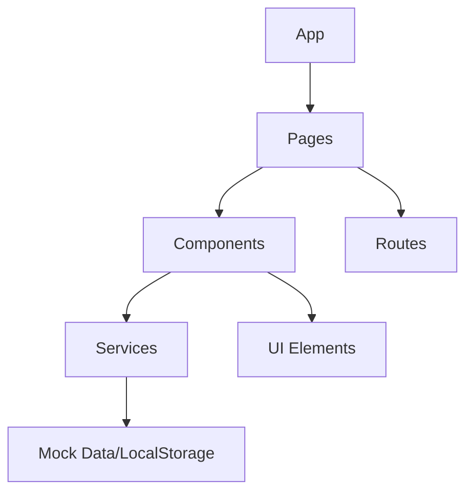
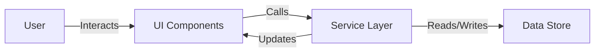

# Tandem - System Patterns

This document outlines the core architectural patterns, design decisions, and system relationships for the Tandem virtual community platform.

## Core Architecture

Tandem follows a component-based architecture with service layers for data handling:

### Key Implementation Patterns

1. **Service Layer Pattern**
   - Implemented for matching, messaging, and profile systems
   - Separates data handling logic from UI components
   - Provides centralized data access and manipulation
   - Enables easier transition to real backend services in the future

2. **Component Composition**
   - UI built from reusable components
   - Clear component hierarchy with specific responsibilities
   - Props-based configuration for flexibility
   - Shared styles via Tailwind CSS utility classes

3. **Page-based Navigation**
   - React Router for declarative routing
   - Nested routes for complex views (e.g., match details within matches)
   - URL parameters for dynamic content (userId, matchId, conversationId)
   - Consistent layout across pages

4. **State Management**
   - Local component state with React Hooks
   - Props for component communication
   - Services for cross-component data access
   - Use of useEffect for side effects and data loading

## Feature Patterns

### Profile System
- **Implementation**: Complete
- **Pattern**: 
  - ProfileService for data operations
  - ProfileView for display
  - ProfileEditForm for modifications
  - SkillManager for managing skills
  - InterestManager for managing interests
  - ProfilePage as container component with tab-style navigation
- **Key Features**:
  - Basic profile information editing
  - Skills management with category, proficiency, and availability
  - Interest management with category filtering
  - Seeking preferences for skills to learn
  - Conditional UI based on ownership (current user vs. other users)

### Matching System
- **Implementation**: Complete
- **Pattern**:
  - MatchingService for algorithm and data
  - MatchList for browsing
  - MatchCard for previews
  - MatchDetail for comprehensive view
- **Key Features**:
  - Complementary skills matching
  - Interest-based filtering
  - Proximity consideration
  - Match quality indicators

### Messaging System
- **Implementation**: Complete
- **Pattern**:
  - MessagingService for conversations and messages
  - ConversationList for browsing
  - MessageThread for interaction
  - Two-panel responsive layout
- **Key Features**:
  - Real-time message composition
  - Conversation management
  - Read status tracking
  - Mobile-responsive design

### Community Discovery System
- **Implementation**: Complete
- **Pattern**:
  - CommunityService for activities and events
  - ActivityCard for browsing activities
  - ActivityList for activity discovery with filtering
  - ActivityDetail for viewing and participating in activities
  - ActivityForm for creating new activities
  - Filtering by category and distance

## Data Flow

The application follows a unidirectional data flow:
1. User interacts with UI components
2. Components call service layer methods
3. Services perform operations on the data store
4. Services return results to components
5. Components update their state and re-render

## Responsive Design Patterns

1. **Mobile-First Approach**
   - Base styles for mobile devices
   - Media queries for larger screens
   - Tailwind's responsive utility classes (sm:, md:, lg:)

2. **Adaptive Layouts**
   - Single-column layouts on mobile
   - Multi-column layouts on desktop
   - Hidden/shown elements based on screen size
   - Flexible sizing with relative units

3. **Touch-Friendly Interactions**
   - Adequate sizing for touch targets
   - Clear visual feedback
   - Simplified interactions on mobile

## UI Component Patterns

1. **Cards**
   - Used for discrete content items (matches, messages, activities)
   - Consistent padding, borders, and shadows
   - Clear information hierarchy

2. **Lists**
   - Vertical stacking of similar items
   - Consistent spacing and dividers
   - Loading and empty states

3. **Forms**
   - Labeled inputs with clear validation
   - Consistent button styling and positioning
   - Error and success feedback
   - Responsive layouts

4. **Navigation**
   - Clear, consistent header
   - Active state indicators
   - Mobile-friendly options

## Future Extensibility Considerations

1. **Backend Integration**
   - Service layer designed for API integration
   - Consistent data models across features
   - Clear separation of concerns

2. **Authentication**
   - Routes prepared for authentication guards
   - UI conditionally renders based on login state
   - Profile system ready for user-specific data

3. **Real-time Features**
   - Messaging system designed for WebSocket integration
   - UI updates optimistically, ready for confirmation

4. **Geolocation**
   - Location data structure in place
   - Matching system considers proximity
   - Ready for map integration
