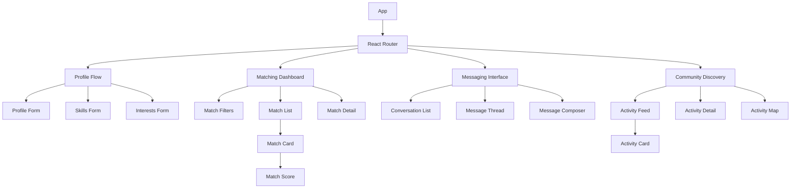

# Tandem - System Patterns

## System Architecture

Tandem follows a modern frontend architecture pattern with the following key characteristics:

### Client-Side Architecture
For the POC, we're implementing a client-side application with:

- **React + Vite**: Frontend framework and build tool combination for rapid development
- **Local Storage Persistence**: Simulating backend data storage for the POC
- **Component-Based Structure**: Modular UI components following React best practices
- **State Management**: React Context API and hooks for state management 
- **Client-Side Routing**: React Router v6 for navigation between views

### Data Flow
1. **Unidirectional Data Flow**: Following React patterns for predictable state changes
2. **Context-Based State Management**: Global state managed via context providers
3. **Component-Level State**: Local state for UI-specific concerns
4. **Event-Driven Updates**: Components respond to user interactions and data changes
5. **Local Persistence**: Data stored in browser localStorage for POC purposes

## Core Design Patterns

### Component Patterns

#### 1. Feature-Based Organization
Components are organized by feature domain:
```
/components
  /profile      # Profile-related components
  /matching     # Matching-related components
  /messaging    # Messaging-related components
  /community    # Community-related components
  /common       # Shared UI elements
```

#### 2. Composition Pattern
Components are composed from smaller, reusable parts:
```jsx
// Example: MatchCard composed of smaller components
<MatchCard>
  <ProfilePhoto />
  <MatchInfo>
    <MatchScore />
    <MatchDistance />
  </MatchInfo>
  <MatchActions />
</MatchCard>
```

#### 3. Container/Presentational Pattern
Separating data handling from presentation:
- **Container Components**: Handle data fetching, state management, and logic
- **Presentational Components**: Focus on rendering UI based on props

#### 4. Provider Pattern
Using React Context to provide data across the component tree:
```jsx
// Example: Authentication Provider
<AuthProvider>
  <App />
</AuthProvider>
```

### Data Patterns

#### 1. Data Models
Core data entities that define the application structure:

```typescript
// User Profile Model
interface UserProfile {
  id: string;
  name: string;
  location: {
    lat: number;
    lng: number;
    displayName: string;
  };
  bio: string;
  profilePhotoUrl: string;
  skills: Skill[];
  interests: string[];
  seeking: SeekingItem[];
  verificationStatus: string;
}

// Skill Model
interface Skill {
  category: string;
  specific: string;
  proficiency: "beginner" | "intermediate" | "expert";
  availability: string;
  description: string;
}

// Message Model
interface Message {
  id: string;
  conversationId: string;
  senderId: string;
  receiverId: string;
  content: string;
  timestamp: Date;
  read: boolean;
}

// Community Activity Model
interface CommunityActivity {
  id: string;
  type: "event" | "activity" | "need";
  title: string;
  description: string;
  creatorId: string;
  location: Location;
  time: {
    start: Date;
    end: Date;
  };
  relatedSkills: string[];
  relatedInterests: string[];
  attendees: string[];
  distance: number;
}
```

#### 2. Service Layer Pattern
Services handle data operations and external communications:
```
/services
  /auth.js         # Authentication operations
  /profiles.js     # Profile management
  /matching.js     # Matching algorithm and operations
  /messaging.js    # Message handling
  /community.js    # Community activities
  /storage.js      # Local storage operations
```

#### 3. Hook Pattern
Custom hooks encapsulate reusable logic:
```jsx
// Example: useMatching hook
function useMatching() {
  const [matches, setMatches] = useState([]);
  const [loading, setLoading] = useState(false);
  
  const fetchMatches = useCallback(async (filters) => {
    setLoading(true);
    try {
      const matchesData = await matchingService.getMatches(filters);
      setMatches(matchesData);
    } finally {
      setLoading(false);
    }
  }, []);
  
  return { matches, loading, fetchMatches };
}
```

## Key Implementation Patterns

### Profile System
- **Progressive Disclosure**: Profile information is collected in stages
- **Skill/Interest Tagging**: Category-based tagging system for skills and interests
- **Location Context**: Geographic proximity as a first-class data point
- **Verification System**: Trust indicators for community safety

### Matching System
- **Complementary Matching**: Connecting people based on complementary skills/needs
- **Interest Overlap**: Identifying shared interests for connection quality
- **Proximity Weighting**: Prioritizing nearby connections
- **Quality Indicators**: Match scoring based on multiple dimensions

### Community Discovery
- **Activity Feed**: Time-based stream of community events
- **Location Filtering**: Geographic filtering of activities
- **Context-Awareness**: Showing activities related to user interests/skills
- **Participation Tracking**: Managing user RSVPs and participation

## Component Relationships



## State Management

### Global State
Managed via React Context:

```jsx
// Example AuthContext
const AuthContext = createContext();

export function AuthProvider({ children }) {
  const [user, setUser] = useState(null);
  const [loading, setLoading] = useState(true);
  
  const login = useCallback((credentials) => {
    // Login logic
  }, []);
  
  const logout = useCallback(() => {
    // Logout logic
  }, []);
  
  const value = {
    user,
    loading,
    login,
    logout
  };
  
  return (
    <AuthContext.Provider value={value}>
      {children}
    </AuthContext.Provider>
  );
}
```

### Local State
Component-specific state using React's useState and useReducer:

```jsx
// Example component with local state
function MatchFilters({ onFilterChange }) {
  const [filters, setFilters] = useState({
    skillsOnly: false,
    interestsOnly: false,
    maxDistance: 10
  });
  
  const handleChange = (key, value) => {
    const newFilters = { ...filters, [key]: value };
    setFilters(newFilters);
    onFilterChange(newFilters);
  };
  
  // Component JSX
}
```

## Key Technical Flows

### Profile Creation Flow
1. User enters basic profile information
2. User selects skill categories 
3. User provides details for each selected skill
4. User adds interests and seeking items
5. Profile is saved and user is redirected to matches

### Matching Algorithm Flow
1. Compare user's skills with others' seeking items
2. Compare user's seeking items with others' skills
3. Identify overlapping interests
4. Calculate geographic proximity
5. Generate match score and sort results

### Messaging Flow
1. User initiates conversation from match detail
2. System creates conversation thread
3. User composes and sends message
4. Recipient receives notification
5. Messages are persisted and displayed in thread view

### Community Discovery Flow
1. System aggregates activities based on location
2. Activities are filtered by relevance to user
3. User browses activity feed
4. User views activity details
5. User RSVPs to participate

## Technical Deployment Strategy
For the POC:
- Vite development server for local testing
- LocalStorage for data persistence
- Simulated authentication
- Static location data

Future production considerations:
- Backend API for data persistence
- Authentication service
- Real geolocation services
- WebSocket for real-time messaging
- CDN for media assets
